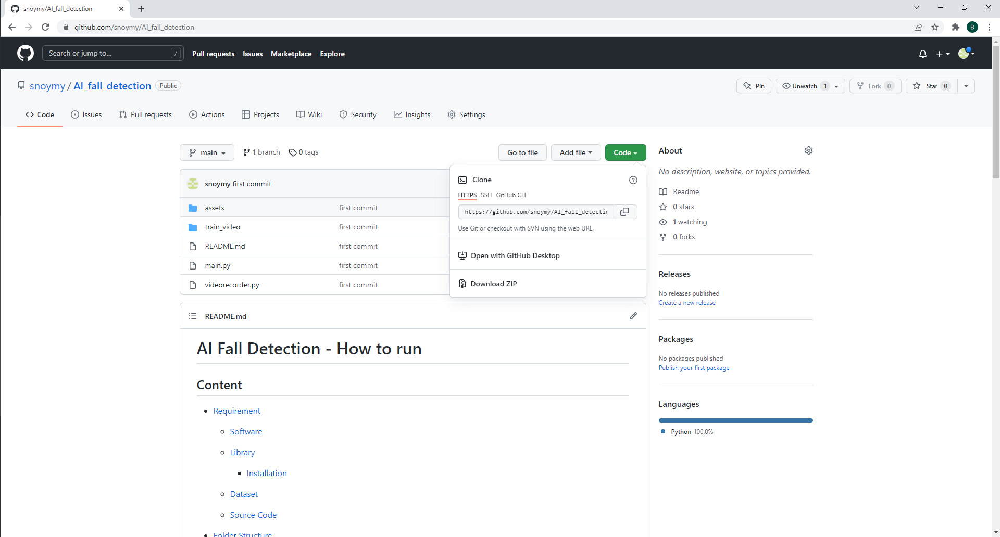
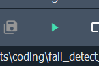
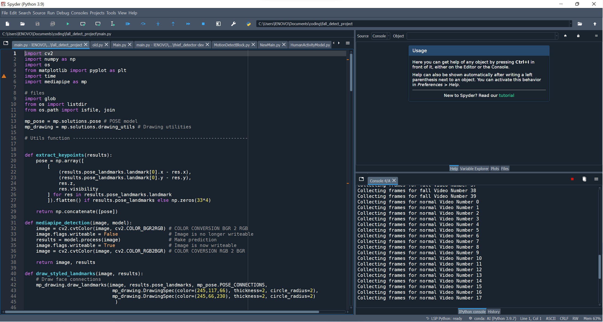
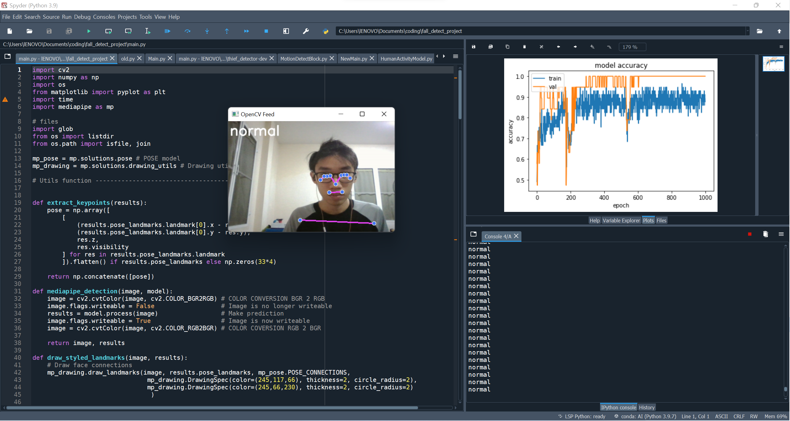
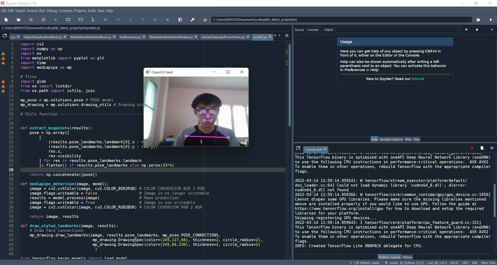

# AI Fall Detection - How to run

## Content

* [Requirement](#requirement)
  
  * [Software](#software)
  
  * [Library](#library)
    
    * [Installation](#installation)
  
  * [Dataset](#dataset)
  
  * [Source Code](#source-code)
  
  * [Clone from github](#clone-from-github)

* [Folder Structure](#folder-structure)

* [Run](#run)
  
  * [Train and predict](#train-and-predict)
  
  * [Predict only](#predict-only)

## Requirement

### Software

* [Anaconda](https://www.anaconda.com/)

* [Spyder](https://www.spyder-ide.org/)

### Library

* [MediaPipe](https://google.github.io/mediapipe/)

* [TensorFlow](https://www.tensorflow.org/)

#### Installation

**Anaconda**

If you are windows user follow steps from this [link](https://docs.anaconda.com/anaconda/install/windows/).

**MediaPipe**

```shell
pip install mediapipe
```

**Tensorflow**

```shell
pip install tensorflow
```

### Dataset

Please download from this [link](https://drive.google.com/drive/folders/10rgr6mk7qBQfZjGZj610k1FPVQBdBMlQ?usp=sharing).

### Source Code

Please download `main.py` , `predict.py` and `videorecorder.py` from this [link](https://drive.google.com/drive/folders/1Fjw_E1Si-6RMxMbPUfr6foi7spSACNcq?usp=sharing).

### Model

Please download from this [link](https://drive.google.com/drive/folders/1t6K_VNCV9Fr_JSKOpQMxyXxD6Tkdf8JX?usp=sharing) (Lastest version is `dense4-2x1000-40vid.h5`).

### Clone from github

via Terminal

```shell
git clone https://github.com/snoymy/AI_fall_detection.git
```

via web [link](https://github.com/snoymy/AI_fall_detection)



## Folder Structure

After install **libray** , **dataset** and **source code** , Please create project root directory `Ex. fall_detector` and place all file you had download in the folder

```
fall_detector
  ├── train_video
  │    ├── fall
  │    └── normal
  ├── main.py
  ├── predict.py
  ├── videorecorder.py
  └── dense4-2x1000-40vid.h5
```

## Run

### Train and predict

Open `main.py` with **Spyder** and press run. This will collect data -> train -> predict.



after run



and predict



you can create new dataset by your self by running`videorecorder.py`.

### Predict only

First you need to have model (can download from Requirement section). Open file `predict.py` and run.


